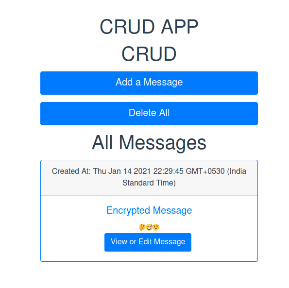

# CRUD app

This app takes message as input and encrypts it according to your selection. Either you can encrypt the message according to the three techniques provided or you can select nothing to store the string as it. You can view, delete or update the message. The app is made with MEVN Stack which is mongoDb, Express, Vuejs and Nodejs.

## Installation

First of all we need to install Node and npm-node package manager which can be done by downloading it from the official website or by running the following commands.

```bash
sudo apt install nodejs
sudo apt install npm
```

Install MongoDB

```bash
wget -qO - https://www.mongodb.org/static/pgp/server-4.4.asc | sudo apt-key add -
echo "deb [ arch=amd64,arm64 ] https://repo.mongodb.org/apt/ubuntu focal/mongodb-org/4.4 multiverse" | sudo tee /etc/apt/sources.list.d/mongodb-org-4.4.list
sudo apt-get update
sudo apt-get install -y mongodb-org
```

Now Extract the folder and in the main directory run the following command to install the required packages

```bash
npm install
```

Run the same command in front-end folder as well which is inside main directory.

## Run

Make sure MongoDb is running by executing following command

```bash
sudo systemctl start mongod
```

In the main directory run the following command to run the server

```bash
node server.js
```

Render Front end with command

```bash
npm run serve
```

Screenshots


